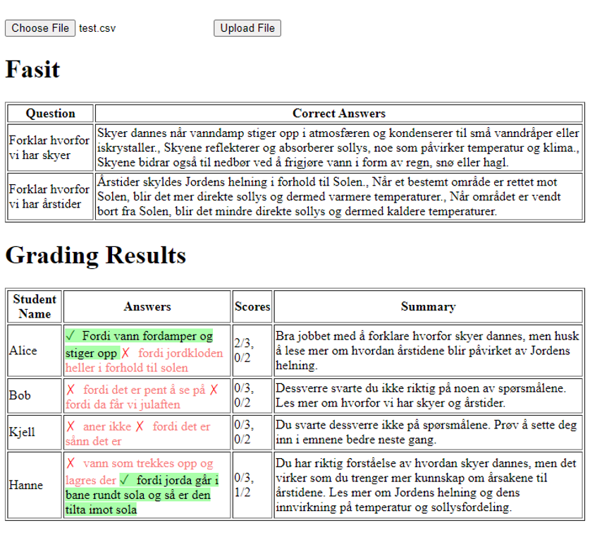

## Historien bak Rettehjelp

Alle gode ideer starter med en tanke, ikke sant? Vel, Rettehjelp kom ikke fra et laboratorium eller en fancy brainstormingsession. Den startet med kona mi og en bunke skolearbeid.

Jeg har sett henne, en dedikert lærer, jobbe kveld etter kveld med prøver som skulle rettes. En kveld, midt i en spesielt stor bunke, sa hun: "Det må da finnes en enklere måte å gjøre dette på?" Og det fikk meg til å tenke.

Da de første avanserte språkmodellene begynte å dukke opp, fikk jeg en idé. Hva om vi kunne kombinere teknologi med lærerens hverdag for å gjøre ting litt enklere? Med hennes innsikt og min tekniske nysgjerrighet, begynte vi å lage en enkel prototype. Og selv om den var enkel, var potensialet klart som dagen.

Etter hvert som ordet spredde seg, og flere ble nysgjerrige på denne lille "hjelperen" vi hadde laget, skjønte vi at dette kunne være noe stort. Så vi tok skrittet videre, finslipte ideen og skapte det som nå er Rettehjelp - skapt av lærere, for lærere.

Lars Erik og Camilla
